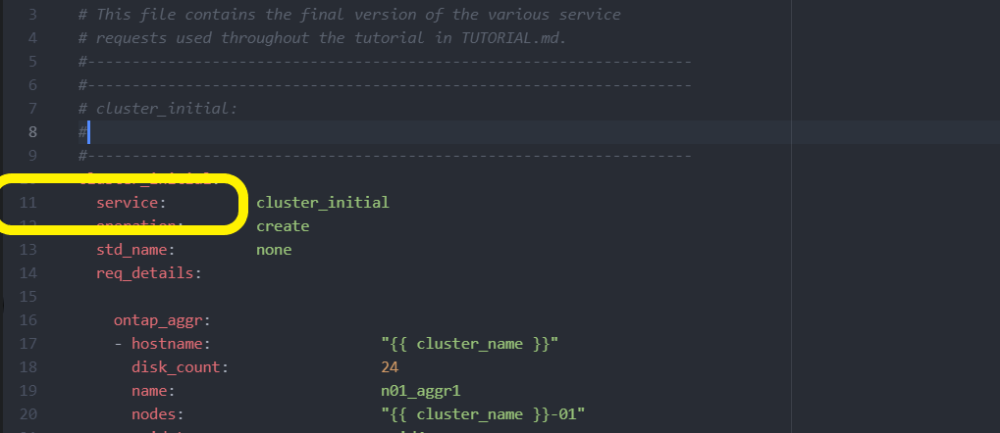
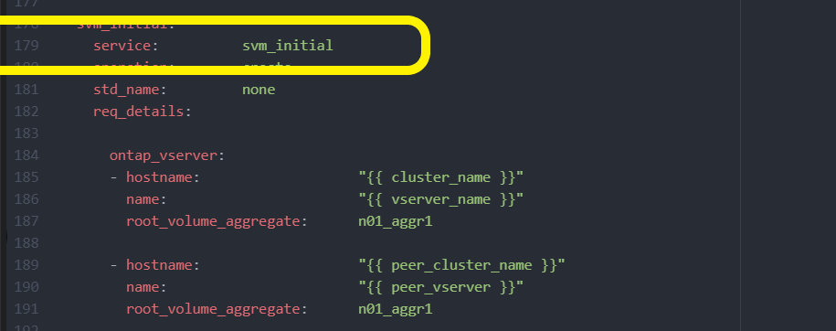

= 使用解決方案部署 ONTAP 叢集
:hardbreaks:
:allow-uri-read: 
:nofooter: 
:icons: font
:linkattrs: 
:imagesdir: ../media/

[role="lead"]
完成準備和規劃之後、您就可以使用 ONTAP Day 0/1 解決方案、使用 Ansible 快速設定 ONTAP 叢集。

在本節步驟中的任何時間、您都可以選擇測試要求、而非實際執行要求。若要測試要求、請將命令列上的教戰手冊變更 `site.yml`為 `logic.yml`。

NOTE:  `docs/tutorial-requests.txt`此位置包含此程序中所使用之所有服務要求的最終版本。如果執行服務要求時遇到困難、您可以將相關要求從檔案複製 `tutorial-requests.txt`到該 `playbooks/inventory/group_vars/all/tutorial-requests.yml`位置、並視需要修改硬編碼值（ IP 位址、集合名稱等）。接著您應該能夠成功執行要求。

== 開始之前

* 您必須安裝 Ansible 。
* 您必須已下載 ONTAP Day 0/1 解決方案、並將資料夾解壓縮至 Ansible 控制節點上所需的位置。
* ONTAP 系統狀態必須符合要求、而且您必須擁有必要的認證。
* 您必須已完成本節所述的所有必要工作link:ontap-day01-prepare.html["準備"]。

NOTE: 本解決方案中的範例使用「 Cluster_01 」和「 Cluster_02 」作為兩個叢集的名稱。您必須使用環境中叢集的名稱來取代這些值。

== 步驟 1 ：初始叢集組態

在此階段、您必須執行一些初始叢集組態步驟。

.步驟
. 瀏覽至該 `playbooks/inventory/group_vars/all/tutorial-requests.yml`位置、並檢閱 `cluster_initial`檔案中的要求。為您的環境進行任何必要的變更。
. 在資料夾中建立服務要求的檔案 `logic-tasks`。例如，建立名為的檔案 `cluster_initial.yml`。
+
將下列各行複製到新檔案：

+
[source, cli]
----
- name: Validate required inputs
  ansible.builtin.assert:
    that:
    - service is defined

- name: Include data files
  ansible.builtin.include_vars:
    file:   "{{ data_file_name }}.yml"
  loop:
  - common-site-stds
  - user-inputs
  - cluster-platform-stds
  - vserver-common-stds
  loop_control:
    loop_var:    data_file_name

- name: Initial cluster configuration
  set_fact:
    raw_service_request:
----
. 定義 `raw_service_request`變數。
+
您可以使用下列其中一個選項、在您在資料夾中建立的檔案 `logic-tasks`中定義 `raw_service_request`變數 `cluster_initial.yml`：

+
** * 選項 1* ：手動定義 `raw_service_request`變數。
+
使用編輯器開啟 `tutorial-requests.yml`檔案、並將內容從第 11 行複製到第 165 行。將內容貼到新檔案中的變數 `cluster_initial.yml`下方 `raw service request`、如下列範例所示：

+

+
.顯示範例
[%collapsible]
====
範例 `cluster_initial.yml`檔案：

[listing]
----
- name: Validate required inputs
  ansible.builtin.assert:
    that:
    - service is defined

- name: Include data files
  ansible.builtin.include_vars:
    file:   "{{ data_file_name }}.yml"
  loop:
  - common-site-stds
  - user-inputs
  - cluster-platform-stds
  - vserver-common-stds
  loop_control:
    loop_var:    data_file_name

- name: Initial cluster configuration
  set_fact:
    raw_service_request:
     service:          cluster_initial
     operation:         create
     std_name:           none
     req_details:

      ontap_aggr:
      - hostname:                   "{{ cluster_name }}"
        disk_count:                 24
        name:                       n01_aggr1
        nodes:                      "{{ cluster_name }}-01"
        raid_type:                  raid4

      - hostname:                   "{{ peer_cluster_name }}"
        disk_count:                 24
        name:                       n01_aggr1
        nodes:                      "{{ peer_cluster_name }}-01"
        raid_type:                  raid4

      ontap_license:
      - hostname:                   "{{ cluster_name }}"
        license_codes:
        - XXXXXXXXXXXXXXAAAAAAAAAAAAAA
        - XXXXXXXXXXXXXXAAAAAAAAAAAAAA
        - XXXXXXXXXXXXXXAAAAAAAAAAAAAA
        - XXXXXXXXXXXXXXAAAAAAAAAAAAAA
        - XXXXXXXXXXXXXXAAAAAAAAAAAAAA
        - XXXXXXXXXXXXXXAAAAAAAAAAAAAA
        - XXXXXXXXXXXXXXAAAAAAAAAAAAAA
        - XXXXXXXXXXXXXXAAAAAAAAAAAAAA
        - XXXXXXXXXXXXXXAAAAAAAAAAAAAA
        - XXXXXXXXXXXXXXAAAAAAAAAAAAAA
        - XXXXXXXXXXXXXXAAAAAAAAAAAAAA
        - XXXXXXXXXXXXXXAAAAAAAAAAAAAA
        - XXXXXXXXXXXXXXAAAAAAAAAAAAAA
        - XXXXXXXXXXXXXXAAAAAAAAAAAAAA
        - XXXXXXXXXXXXXXAAAAAAAAAAAAAA
        - XXXXXXXXXXXXXXAAAAAAAAAAAAAA
        - XXXXXXXXXXXXXXAAAAAAAAAAAAAA
        - XXXXXXXXXXXXXXAAAAAAAAAAAAAA
        - XXXXXXXXXXXXXXAAAAAAAAAAAAAA
        - XXXXXXXXXXXXXXAAAAAAAAAAAAAA
        - XXXXXXXXXXXXXXAAAAAAAAAAAAAA
        - XXXXXXXXXXXXXXAAAAAAAAAAAAAA
        - XXXXXXXXXXXXXXAAAAAAAAAAAAAA
        - XXXXXXXXXXXXXXAAAAAAAAAAAAAA
        - XXXXXXXXXXXXXXAAAAAAAAAAAAAA
        - XXXXXXXXXXXXXXAAAAAAAAAAAAAA
        - XXXXXXXXXXXXXXAAAAAAAAAAAAAA
        - XXXXXXXXXXXXXXAAAAAAAAAAAAAA
        - XXXXXXXXXXXXXXAAAAAAAAAAAAAA
        - XXXXXXXXXXXXXXAAAAAAAAAAAAAA
        - XXXXXXXXXXXXXXAAAAAAAAAAAAAA

    - hostname:                   "{{ peer_cluster_name }}"
      license_codes:
        - XXXXXXXXXXXXXXAAAAAAAAAAAAAA
        - XXXXXXXXXXXXXXAAAAAAAAAAAAAA
        - XXXXXXXXXXXXXXAAAAAAAAAAAAAA
        - XXXXXXXXXXXXXXAAAAAAAAAAAAAA
        - XXXXXXXXXXXXXXAAAAAAAAAAAAAA
        - XXXXXXXXXXXXXXAAAAAAAAAAAAAA
        - XXXXXXXXXXXXXXAAAAAAAAAAAAAA
        - XXXXXXXXXXXXXXAAAAAAAAAAAAAA
        - XXXXXXXXXXXXXXAAAAAAAAAAAAAA
        - XXXXXXXXXXXXXXAAAAAAAAAAAAAA
        - XXXXXXXXXXXXXXAAAAAAAAAAAAAA
        - XXXXXXXXXXXXXXAAAAAAAAAAAAAA
        - XXXXXXXXXXXXXXAAAAAAAAAAAAAA
        - XXXXXXXXXXXXXXAAAAAAAAAAAAAA
        - XXXXXXXXXXXXXXAAAAAAAAAAAAAA
        - XXXXXXXXXXXXXXAAAAAAAAAAAAAA
        - XXXXXXXXXXXXXXAAAAAAAAAAAAAA
        - XXXXXXXXXXXXXXAAAAAAAAAAAAAA
        - XXXXXXXXXXXXXXAAAAAAAAAAAAAA
        - XXXXXXXXXXXXXXAAAAAAAAAAAAAA
        - XXXXXXXXXXXXXXAAAAAAAAAAAAAA
        - XXXXXXXXXXXXXXAAAAAAAAAAAAAA
        - XXXXXXXXXXXXXXAAAAAAAAAAAAAA
        - XXXXXXXXXXXXXXAAAAAAAAAAAAAA
        - XXXXXXXXXXXXXXAAAAAAAAAAAAAA
        - XXXXXXXXXXXXXXAAAAAAAAAAAAAA
        - XXXXXXXXXXXXXXAAAAAAAAAAAAAA
        - XXXXXXXXXXXXXXAAAAAAAAAAAAAA
        - XXXXXXXXXXXXXXAAAAAAAAAAAAAA
        - XXXXXXXXXXXXXXAAAAAAAAAAAAAA

    ontap_motd:
    - hostname:                   "{{ cluster_name }}"
      vserver:                    "{{ cluster_name }}"
      message:                    "New MOTD"

    - hostname:                   "{{ peer_cluster_name }}"
      vserver:                    "{{ peer_cluster_name }}"
      message:                    "New MOTD"

    ontap_interface:
    - hostname:                   "{{ cluster_name }}"
      vserver:                    "{{ cluster_name }}"
      interface_name:             ic01
      role:                       intercluster
      address:                    10.0.0.101
      netmask:                    255.255.255.0
      home_node:                  "{{ cluster_name }}-01"
      home_port:                  e0c
      ipspace:                    Default
      use_rest:                   never

    - hostname:                   "{{ cluster_name }}"
      vserver:                    "{{ cluster_name }}"
      interface_name:             ic02
      role:                       intercluster
      address:                    10.0.0.101
      netmask:                    255.255.255.0
      home_node:                  "{{ cluster_name }}-01"
      home_port:                  e0c
      ipspace:                    Default
      use_rest:                   never

    - hostname:                   "{{ peer_cluster_name }}"
      vserver:                    "{{ peer_cluster_name }}"
      interface_name:             ic01
      role:                       intercluster
      address:                    10.0.0.101
      netmask:                    255.255.255.0
      home_node:                  "{{ peer_cluster_name }}-01"
      home_port:                  e0c
      ipspace:                    Default
      use_rest:                   never

    - hostname:                   "{{ peer_cluster_name }}"
      vserver:                    "{{ peer_cluster_name }}"
      interface_name:             ic02
      role:                       intercluster
      address:                    10.0.0.101
      netmask:                    255.255.255.0
      home_node:                  "{{ peer_cluster_name }}-01"
      home_port:                  e0c
      ipspace:                    Default
      use_rest:                   never

    ontap_cluster_peer:
    - hostname:                   "{{ cluster_name }}"
      dest_cluster_name:          "{{ peer_cluster_name }}"
      dest_intercluster_lifs:     "{{ peer_lifs }}"
      source_cluster_name:        "{{ cluster_name }}"
      source_intercluster_lifs:   "{{ cluster_lifs }}"
      peer_options:
        hostname:                 "{{ peer_cluster_name }}"

----
====
** * 選項 2* ：使用忍者範本定義要求：
+
您也可以使用下列 Jinja 範本格式來取得 `raw_service_request`值。

+
`raw_service_request:      "{{ cluster_initial }}"`

. 為第一個叢集執行初始叢集組態：
+
[source, cli]
----
ansible-playbook -i inventory/hosts site.yml -e cluster_name=<Cluster_01>
----
+
繼續之前、請確認沒有錯誤。

. 對第二個叢集重複執行命令：
+
[source, cli]
----
ansible-playbook -i inventory/hosts site.yml -e cluster_name=<Cluster_02>
----
+
確認第二個叢集沒有錯誤。

+
往上捲動至 Ansible 輸出的開頭時、您應該會看到傳送至架構的要求、如下列範例所示：

+
.顯示範例
[%collapsible]
====
[listing]
----
TASK [Show the raw_service_request] ************************************************************************************************************
ok: [localhost] => {
    "raw_service_request": {
        "operation": "create",
        "req_details": {
            "ontap_aggr": [
                {
                    "disk_count": 24,
                    "hostname": "Cluster_01",
                    "name": "n01_aggr1",
                    "nodes": "Cluster_01-01",
                    "raid_type": "raid4"
                }
            ],
            "ontap_license": [
                {
                    "hostname": "Cluster_01",
                    "license_codes": [
                        "XXXXXXXXXXXXXXXAAAAAAAAAAAA",
                        "XXXXXXXXXXXXXXAAAAAAAAAAAAA",
                        "XXXXXXXXXXXXXXAAAAAAAAAAAAA",
                        "XXXXXXXXXXXXXXAAAAAAAAAAAAA",
                        "XXXXXXXXXXXXXXAAAAAAAAAAAAA",
                        "XXXXXXXXXXXXXXAAAAAAAAAAAAA",
                        "XXXXXXXXXXXXXXAAAAAAAAAAAAA",
                        "XXXXXXXXXXXXXXAAAAAAAAAAAAA",
                        "XXXXXXXXXXXXXXAAAAAAAAAAAAA",
                        "XXXXXXXXXXXXXXAAAAAAAAAAAAA",
                        "XXXXXXXXXXXXXXAAAAAAAAAAAAA",
                        "XXXXXXXXXXXXXXAAAAAAAAAAAAA",
                        "XXXXXXXXXXXXXXAAAAAAAAAAAAA",
                        "XXXXXXXXXXXXXXAAAAAAAAAAAAA",
                        "XXXXXXXXXXXXXXAAAAAAAAAAAAA",
                        "XXXXXXXXXXXXXXAAAAAAAAAAAAA",
                        "XXXXXXXXXXXXXXAAAAAAAAAAAAA",
                        "XXXXXXXXXXXXXXAAAAAAAAAAAAA",
                        "XXXXXXXXXXXXXXAAAAAAAAAAAAA",
                        "XXXXXXXXXXXXXXAAAAAAAAAAAAA",
                        "XXXXXXXXXXXXXXAAAAAAAAAAAAA",
                        "XXXXXXXXXXXXXXAAAAAAAAAAAAA",
                        "XXXXXXXXXXXXXXAAAAAAAAAAAAA",
                        "XXXXXXXXXXXXXXAAAAAAAAAAAAA",
                        "XXXXXXXXXXXXXXAAAAAAAAAAAAA",
                        "XXXXXXXXXXXXXXAAAAAAAAAAAAA",
                        "XXXXXXXXXXXXXXAAAAAAAAAAAAA",
                        "XXXXXXXXXXXXXXAAAAAAAAAAAAA",
                        "XXXXXXXXXXXXXXAAAAAAAAAAAAA",
                        "XXXXXXXXXXXXXXAAAAAAAAAAAAA",
                        "XXXXXXXXXXXXXXAAAAAAAAAAAAA",
                        "XXXXXXXXXXXXXXAAAAAAAAAAAAA",
                        "XXXXXXXXXXXXXXAAAAAAAAAAAAA",
                        "XXXXXXXXXXXXXXAAAAAAAAAAAAA"
                    ]
                }
            ],
            "ontap_motd": [
                {
                    "hostname": "Cluster_01",
                    "message": "New MOTD",
                    "vserver": "Cluster_01"
                }
            ]
        },
        "service": "cluster_initial",
        "std_name": "none"
    }
}
----
====
. 登入每個 ONTAP 執行個體、並驗證要求是否成功。

== 步驟 2 ：設定叢集間的生命週期

您現在可以將 LIF 定義新增至要求並定義微服務、 `ontap_interface`以設定叢集間的生命 `cluster_initial`體。

服務定義和要求會共同運作、以決定行動：

* 如果您提供的微服務服務請求不在服務定義中、則不會執行該要求。
* 如果您在服務定義中定義了一或多個微服務、但在要求中省略、則不會執行該要求。

教戰手冊會 `execution.yml`依所列順序掃描微服務清單、以評估服務定義：

* 如果要求中有一個項目的字典金鑰與微服務定義中包含的項目相符 `args`、則會執行該要求。
* 如果服務要求中沒有相符的項目、則會跳過該要求、而不會發生錯誤。

.步驟
. 瀏覽至 `cluster_initial.yml`您先前建立的檔案、並在要求定義中新增下列行以修改要求：
+
[source, cli]
----
    ontap_interface:
    - hostname:                   "{{ cluster_name }}"
      vserver:                    "{{ cluster_name }}"
      interface_name:             ic01
      role:                       intercluster
      address:                    <ip_address>
      netmask:                    <netmask_address>
      home_node:                  "{{ cluster_name }}-01"
      home_port:                  e0c
      ipspace:                    Default
      use_rest:                   never

    - hostname:                   "{{ cluster_name }}"
      vserver:                    "{{ cluster_name }}"
      interface_name:             ic02
      role:                       intercluster
      address:                    <ip_address>
      netmask:                    <netmask_address>
      home_node:                  "{{ cluster_name }}-01"
      home_port:                  e0c
      ipspace:                    Default
      use_rest:                   never

    - hostname:                   "{{ peer_cluster_name }}"
      vserver:                    "{{ peer_cluster_name }}"
      interface_name:             ic01
      role:                       intercluster
      address:                    <ip_address>
      netmask:                    <netmask_address>
      home_node:                  "{{ peer_cluster_name }}-01"
      home_port:                  e0c
      ipspace:                    Default
      use_rest:                   never

    - hostname:                   "{{ peer_cluster_name }}"
      vserver:                    "{{ peer_cluster_name }}"
      interface_name:             ic02
      role:                       intercluster
      address:                    <ip_address>
      netmask:                    <netmask_address>
      home_node:                  "{{ peer_cluster_name }}-01"
      home_port:                  e0c
      ipspace:                    Default
      use_rest:                   never
----
. 執行命令：
+
[source, cli]
----
ansible-playbook -i inventory/hosts  site.yml -e cluster_name=<Cluster_01> -e peer_cluster_name=<Cluster_02>
----
. 登入每個執行個體、檢查是否已將生命期新增至叢集：
+
.顯示範例
[%collapsible]
====
[listing]
----
Cluster_01::> net int show
  (network interface show)
            Logical    Status     Network            Current       Current Is
Vserver     Interface  Admin/Oper Address/Mask       Node          Port    Home
----------- ---------- ---------- ------------------ ------------- ------- ----
Cluster_01
            Cluster_01-01_mgmt up/up 10.0.0.101/24   Cluster_01-01 e0c     true
            Cluster_01-01_mgmt_auto up/up 10.101.101.101/24 Cluster_01-01 e0c true
            cluster_mgmt up/up    10.0.0.110/24      Cluster_01-01 e0c     true
5 entries were displayed.
----
====
+
輸出顯示已添加 * 非 * 的生命。這是因為 `ontap_interface`仍需要在檔案中定義微服務 `services.yml`。

. 確認已將生命項新增至 `raw_service_request`變數。
+
.顯示範例
[%collapsible]
====
以下範例顯示已將生命提升新增至要求：

[listing]
----
           "ontap_interface": [
                {
                    "address": "10.0.0.101",
                    "home_node": "Cluster_01-01",
                    "home_port": "e0c",
                    "hostname": "Cluster_01",
                    "interface_name": "ic01",
                    "ipspace": "Default",
                    "netmask": "255.255.255.0",
                    "role": "intercluster",
                    "use_rest": "never",
                    "vserver": "Cluster_01"
                },
                {
                    "address": "10.0.0.101",
                    "home_node": "Cluster_01-01",
                    "home_port": "e0c",
                    "hostname": "Cluster_01",
                    "interface_name": "ic02",
                    "ipspace": "Default",
                    "netmask": "255.255.255.0",
                    "role": "intercluster",
                    "use_rest": "never",
                    "vserver": "Cluster_01"
                },
                {
                    "address": "10.0.0.101",
                    "home_node": "Cluster_02-01",
                    "home_port": "e0c",
                    "hostname": "Cluster_02",
                    "interface_name": "ic01",
                    "ipspace": "Default",
                    "netmask": "255.255.255.0",
                    "role": "intercluster",
                    "use_rest": "never",
                    "vserver": "Cluster_02"
                },
                {
                    "address": "10.0.0.126",
                    "home_node": "Cluster_02-01",
                    "home_port": "e0c",
                    "hostname": "Cluster_02",
                    "interface_name": "ic02",
                    "ipspace": "Default",
                    "netmask": "255.255.255.0",
                    "role": "intercluster",
                    "use_rest": "never",
                    "vserver": "Cluster_02"
                }
            ],
----
====
. 在檔案中 `services.yml`的下定義 `ontap_interface`微服務 `cluster_initial`。
+
將下列各行複製到檔案中以定義微服務：

+
[source, cli]
----
        - name: ontap_interface
          args: ontap_interface
          role: na/ontap_interface
----
. 現在已 `ontap_interface`在要求和檔案中定義微服務 `services.yml`、請再次執行要求：
+
[source, cli]
----
ansible-playbook -i inventory/hosts  site.yml -e cluster_name=<Cluster_01> -e peer_cluster_name=<Cluster_02>
----
. 登入每個 ONTAP 執行個體、並確認已新增生命。

== 步驟 3 ：選擇性地設定多個叢集

如果需要、您可以在同一個要求中設定多個叢集。定義要求時、您必須為每個叢集提供變數名稱。

.步驟
. 在檔案中新增第二個叢集的項目 `cluster_initial.yml`、以便在同一個要求中設定兩個叢集。
+
下列範例顯示 `ontap_aggr`新增第二個項目之後的欄位。

+
[listing]
----
   ontap_aggr:
    - hostname:                   "{{ cluster_name }}"
      disk_count:                 24
      name:                       n01_aggr1
      nodes:                      "{{ cluster_name }}-01"
      raid_type:                  raid4

    - hostname:                   "{{ peer_cluster_name }}"
      disk_count:                 24
      name:                       n01_aggr1
      nodes:                      "{{ peer_cluster_name }}-01"
      raid_type:                  raid4
----
. 對下的所有其他項目套用變更 `cluster_initial`。
. 將下列各行複製到檔案中、將叢集對等關係新增到要求：
+
[source, cli]
----
    ontap_cluster_peer:
    - hostname:                   "{{ cluster_name }}"
      dest_cluster_name:          "{{ cluster_peer }}"
      dest_intercluster_lifs:     "{{ peer_lifs }}"
      source_cluster_name:        "{{ cluster_name }}"
      source_intercluster_lifs:   "{{ cluster_lifs }}"
      peer_options:
        hostname:                 "{{ cluster_peer }}"
----
. 執行 Ansible 要求：
+
[source, cli]
----
ansible-playbook -i inventory/hosts -e cluster_name=<Cluster_01>
site.yml -e peer_cluster_name=<Cluster_02> -e cluster_lifs=<cluster_lif_1_IP_address,cluster_lif_2_IP_address>
-e peer_lifs=<peer_lif_1_IP_address,peer_lif_2_IP_address>
----

== 步驟 4 ：初始 SVM 組態

在本程序的這個階段、您可以在叢集中設定 SVM 。

.步驟
. 更新 `svm_initial`檔案中的要求 `tutorial-requests.yml`、以設定 SVM 和 SVM 對等關係。
+
您必須設定下列項目：

+
** SVM
** SVM 對等關係
** 每個 SVM 的 SVM 介面

. 更新要求定義中的變數定義 `svm_initial`。您必須修改下列變數定義：
+
** `cluster_name`
** `vserver_name`
** `peer_cluster_name`
** `peer_vserver`
+
若要更新定義、請在 `svm_initial`定義之後移除 * 「 ｛ ｝ 」 * 、然後 `req_details`新增正確的定義。

. 在資料夾中建立服務要求的檔案 `logic-tasks`。例如，建立名為的檔案 `svm_initial.yml`。
+
將下列各行複製到檔案：

+
[source, cli]
----
- name: Validate required inputs
  ansible.builtin.assert:
    that:
    - service is defined

- name: Include data files
  ansible.builtin.include_vars:
    file:   "{{ data_file_name }}.yml"
  loop:
  - common-site-stds
  - user-inputs
  - cluster-platform-stds
  - vserver-common-stds
  loop_control:
    loop_var:    data_file_name

- name: Initial SVM configuration
  set_fact:
    raw_service_request:
----
. 定義 `raw_service_request`變數。
+
您可以使用下列其中一個選項、在資料夾中 `logic-tasks`定義 `raw_service_request`的變數 `svm_initial`：

+
** * 選項 1* ：手動定義 `raw_service_request`變數。
+
使用編輯器開啟 `tutorial-requests.yml`檔案、並將內容從第 179 行複製到第 222 行。將內容貼到新檔案中的變數 `svm_initial.yml`下方 `raw service request`、如下列範例所示：

+

+
.顯示範例
[%collapsible]
====
範例 `svm_initial.yml`檔案：

[listing]
----
- name: Validate required inputs
  ansible.builtin.assert:
    that:
    - service is defined

- name: Include data files
  ansible.builtin.include_vars:
    file:   "{{ data_file_name }}.yml"
  loop:
  - common-site-stds
  - user-inputs
  - cluster-platform-stds
  - vserver-common-stds
  loop_control:
    loop_var:    data_file_name

- name: Initial SVM configuration
  set_fact:
    raw_service_request:
     service:          svm_initial
     operation:        create
     std_name:         none
     req_details:

      ontap_vserver:
      - hostname:                   "{{ cluster_name }}"
        name:                       "{{ vserver_name }}"
        root_volume_aggregate:      n01_aggr1

      - hostname:                   "{{ peer_cluster_name }}"
       name:                       "{{ peer_vserver }}"
       root_volume_aggregate:      n01_aggr1

      ontap_vserver_peer:
      - hostname:                   "{{ cluster_name }}"
        vserver:                    "{{ vserver_name }}"
        peer_vserver:               "{{ peer_vserver }}"
        applications:               snapmirror
        peer_options:
          hostname:                 "{{ peer_cluster_name }}"

      ontap_interface:
      - hostname:                   "{{ cluster_name }}"
        vserver:                    "{{ vserver_name }}"
        interface_name:             data01
        role:                       data
        address:                    10.0.0.200
        netmask:                    255.255.255.0
        home_node:                  "{{ cluster_name }}-01"
        home_port:                  e0c
        ipspace:                    Default
        use_rest:                   never

      - hostname:                   "{{ peer_cluster_name }}"
        vserver:                    "{{ peer_vserver }}"
        interface_name:             data01
        role:                       data
        address:                    10.0.0.201
        netmask:                    255.255.255.0
        home_node:                  "{{ peer_cluster_name }}-01"
        home_port:                  e0c
        ipspace:                    Default
        use_rest:                   never
----
====
** * 選項 2* ：使用忍者範本定義要求：
+
您也可以使用下列 Jinja 範本格式來取得 `raw_service_request`值。

+
[listing]
----
raw_service_request: "{{ svm_initial }}"
----

. 執行要求：
+
[source, cli]
----
ansible-playbook -i inventory/hosts -e cluster_name=<Cluster_01> -e peer_cluster_name=<Cluster_02> -e peer_vserver=<SVM_02>  -e vserver_name=<SVM_01> site.yml
----
. 登入每個 ONTAP 執行個體並驗證組態。
. 新增 SVM 介面。
+
在檔案中的 `services.yml`下定義 `ontap_interface`服務 `svm_initial`、然後再次執行要求：

+
[source, cli]
----
ansible-playbook -i inventory/hosts -e cluster_name=<Cluster_01> -e peer_cluster_name=<Cluster_02> -e peer_vserver=<SVM_02>  -e vserver_name=<SVM_01> site.yml
----
. 登入每個 ONTAP 執行個體、並確認 SVM 介面已設定完成。

== 步驟 5 ：選擇性地動態定義服務要求

在先前的步驟中、 `raw_service_request`變數是硬式編碼的。這對學習、開發和測試都很有用。您也可以動態產生服務要求。

如果您不想將其與較高層級的系統整合、則下節提供動態產生所需的選項 `raw_service_request`。

[IMPORTANT]
====
* 如果未在命令中定義變數、 `logic.yml`則 `logic_operation`檔案不會從資料夾匯入任何檔案 `logic-tasks`。這表示 `raw_service_request`必須在 Ansible 之外定義、並提供給執行架構。
* 資料夾中的工作檔案名稱必須符合不含 .yml 副檔名 `logic-tasks`的變數值 `logic_operation`。
* 資料夾中的工作檔案 `logic-tasks`會動態定義 `raw_service_request`。唯一的需求是將有效 `raw_service_request`定義為相關檔案中的最後一項工作。

====
.如何動態定義服務要求
有多種方法可以套用邏輯工作來動態定義服務要求。以下列出其中一些選項：

* 使用資料夾中的 Ansible 工作檔案 `logic-tasks`
* 啟動可傳回適合轉換為 varaible 之資料的自訂角色 `raw_service_request`。
* 在 Ansible 環境以外調用其他工具以提供所需的資料。例如、 REST API 呼叫 Active IQ Unified Manager 。

下列命令範例會使用檔案動態定義每個叢集的服務要求 `tutorial-requests.yml`：

[source, cli]
----
ansible-playbook -i inventory/hosts -e cluster2provision=Cluster_01
-e logic_operation=tutorial-requests site.yml
----
[source, cli]
----
ansible-playbook -i inventory/hosts -e cluster2provision=Cluster_02
-e logic_operation=tutorial-requests site.yml
----

== 步驟 6 ：部署 ONTAP Day 0/1 解決方案

在此階段、您應該已經完成下列工作：

* 根據您的需求檢閱及修改中的所有檔案 `playbooks/inventory/group_vars/all`。每個檔案中都有詳細的註解、可協助您進行變更。
* 已將任何必要的工作檔案新增至 `logic-tasks`目錄。
* 已將任何必要的資料檔案新增至 `playbook/vars`目錄。

使用下列命令部署 ONTAP Day 0/1 解決方案、並驗證部署的健全狀況：

NOTE: 在此階段、您應該已經解密並修改 `vault.yml`檔案、而且必須使用新密碼來加密。

* 執行 ONTAP Day 0 服務：
+
[source, cli]
----
ansible-playbook -i playbooks/inventory/hosts playbooks/site.yml -e logic_operation=cluster_day_0 -e service=cluster_day_0 -vvvv --ask-vault-pass <your_vault_password>
----
* 執行 ONTAP Day 1 服務：
+
[source, cli]
----
ansible-playbook -i playbooks/inventory/hosts playbooks/site.yml -e logic_operation=cluster_day_1 -e service=cluster_day_0 -vvvv --ask-vault-pass <your_vault_password>
----
* 套用叢集整體設定：
+
[source, cli]
----
ansible-playbook -i playbooks/inventory/hosts playbooks/site.yml -e logic_operation=cluster_wide_settings -e service=cluster_wide_settings -vvvv --ask-vault-pass <your_vault_password>
----
* 執行健全狀況檢查：
+
[source, cli]
----
ansible-playbook -i playbooks/inventory/hosts playbooks/site.yml -e logic_operation=health_checks -e service=health_checks -e enable_health_reports=true -vvvv --ask-vault-pass <your_vault_password>
----

